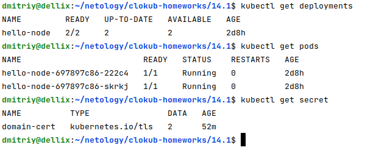

# Домашнее задание к занятию "14.1 Создание и использование секретов"

## Задача 1: Работа с секретами через утилиту kubectl в установленном minikube

Выполните приведённые ниже команды в консоли, получите вывод команд. Сохраните
задачу 1 как справочный материал.

### Как создать секрет?

```
openssl genrsa -out cert.key 4096
openssl req -x509 -new -key cert.key -days 3650 -out cert.crt \
-subj '/C=RU/ST=Moscow/L=Moscow/CN=server.local'
kubectl create secret tls domain-cert --cert=certs/cert.crt --key=certs/cert.key
```

### Как просмотреть список секретов?

```
kubectl get secrets
kubectl get secret
```

### Как просмотреть секрет?

```
kubectl get secret domain-cert
kubectl describe secret domain-cert
```

### Как получить информацию в формате YAML и/или JSON?

```
kubectl get secret domain-cert -o yaml
kubectl get secret domain-cert -o json
```

### Как выгрузить секрет и сохранить его в файл?

```
kubectl get secrets -o json > secrets.json
kubectl get secret domain-cert -o yaml > domain-cert.yml
```

### Как удалить секрет?

```
kubectl delete secret domain-cert
```

### Как загрузить секрет из файла?

```
kubectl apply -f domain-cert.yml
```

## Задача 2 (*): Работа с секретами внутри модуля

Выберите любимый образ контейнера, подключите секреты и проверьте их доступность
как в виде переменных окружения, так и в виде примонтированного тома.


# Ответ:

Команды из задания чуть модифицировал, т.к. в одной части команд есть папка certs, а в другой нет.

```shell
dmitriy@dellix:~/netology/clokub-homeworks/14.1$ mkdir certs
dmitriy@dellix:~/netology/clokub-homeworks/14.1$ openssl genrsa -out certs/cert.key 4096
dmitriy@dellix:~/netology/clokub-homeworks/14.1$ openssl req -x509 -new -key certs/cert.key -days 3650 -out certs/cert.crt -subj '/C=RU/ST=Moscow/L=Moscow/CN=server.local'
dmitriy@dellix:~/netology/clokub-homeworks/14.1$ kubectl create secret tls domain-cert --cert=certs/cert.crt --key=certs/cert.key
secret/domain-cert created
dmitriy@dellix:~/netology/clokub-homeworks/14.1$ kubectl get secrets
NAME          TYPE                DATA   AGE
domain-cert   kubernetes.io/tls   2      16s
dmitriy@dellix:~/netology/clokub-homeworks/14.1$ kubectl get secret
NAME          TYPE                DATA   AGE
domain-cert   kubernetes.io/tls   2      27s
dmitriy@dellix:~/netology/clokub-homeworks/14.1$ kubectl get secret domain-cert
NAME          TYPE                DATA   AGE
domain-cert   kubernetes.io/tls   2      43s
dmitriy@dellix:~/netology/clokub-homeworks/14.1$ kubectl describe secret domain-cert
Name:         domain-cert
Namespace:    default
Labels:       <none>
Annotations:  <none>

Type:  kubernetes.io/tls

Data
====
tls.crt:  1944 bytes
tls.key:  3272 bytes
dmitriy@dellix:~/netology/clokub-homeworks/14.1$ kubectl get secret domain-cert -o yaml
apiVersion: v1
data:
  tls.crt: LS0tLS1CRUdJTiBDRVJUSUZJQ0FURS0tLS0tCk1JSUZiVENDQTFXZ0F3SUJBZ0lVTVBCMkFVejd5U2N0R1hPbzR2UzZTdDZaTXZrd0RRWUpLb1pJaHZjTkFRRUwKQlFBd1JqRUxNQWtHQTFVRUJoTUNVbFV4RHpBTkJnTlZCQWdNQmsxdmMyTnZkekVQTUEwR0ExVUVCd3dHVFc5egpZMjkzTVJVd0V3WURWUVFEREF4elpYSjJaWEl1Ykc5allXd3dIaGNOTWpJeE1qTXdNVEExTlRNd1doY05Nekl4Ck1qSTNNVEExTlRNd1dqQkdNUXN3Q1FZRFZRUUdFd0pTVlRFUE1BMEdBMVVFQ0F3R1RXOXpZMjkzTVE4d0RRWUQKVlFRSERBWk5iM05qYjNjeEZUQVRCZ05WQkFNTURITmxjblpsY2k1c2IyTmhiRENDQWlJd0RRWUpLb1pJaHZjTgpBUUVCQlFBRGdnSVBBRENDQWdvQ2dnSUJBS0EwSTAwWWcvWjZ1TkQrTThaZnpBZjRKZi9KcGF5WGt1SWluakl2CmVzbmhqbmg2eG9OaCtGSjh0NGZCNi9PMWpRVjYrOEZ2cnZxSGlmNTRYUkM3K0Q0dEhubCtlNnc4SkNLbnp1bEoKVm5CRm53R0pSSGhBOWZ0N2JkM2hXTlo1R0psWFdRWUlUTmlHeUVGSVNjY3A1NmRSQzNuTzBGZ2ZTdk03c1dUUQpuUmxtVUZHc3NJYlp2VEZ6YXRMc0RSMk42R0FHZXlGeHpaY01FTkl6UzJrT091SWY0YnU5bmh0SlBQZjRvZDE2CnM5RjF1VW9rK0Q1UTUyQVZXR3ZUSXVCTnN0azVTcDdVa1ZxY2ZXR0M1OUdwTm5COVhIUHBRU0RlVDl5SnVrdmsKdEZjK2V6NlNvMzRDQStsazY5WFcvVzRXdkhGdHNSTDgyOVVyRjFPWFF5L3VMOUVWVFBuOFFyVmwwZlNWQndiMwpIdU90R2xVUmgyQzc3bFVZQVZXTFg3M2VidUJaVk5vbHlHdXFtZlNIcHdSV3kxREJPR2RKQTRSYUdHaVk1SmhXCkxKOGErd0lHVHdqa0NDZlY4aEpiQ0l3NUVITWRocEhNTm92eU5oVWJONXM4OW9OTUJ2MTNrQkphWFNpMEZLQk8KMkhKYThWNTRRTFYvYXArb1R1MTdNU2pwaTEyQjM1N2kvTEFURjhlck1mYnhkNzczUXh5eWlCUmNsL2FzWk50TAprRWRtQ3dOV295NkMwdHlZcTlBUytwYXFCQWRueTMwdEZpVm1jVnNSY3RwRkMxaE0xcWhWL2lnOGhTWHhKNUd4Cm90MS8wVjhrYUF3Z3lxUWVUbTJCWXA5cXFOdyttTUZYRE1KZHZDdmViaThqZDd4MW56Vm1MMmh0WTFaaXNSK2EKYTNmeEFnTUJBQUdqVXpCUk1CMEdBMVVkRGdRV0JCU3pxUWZnejg4NGZGSms1S2oxemFUdzA3RGkrVEFmQmdOVgpIU01FR0RBV2dCU3pxUWZnejg4NGZGSms1S2oxemFUdzA3RGkrVEFQQmdOVkhSTUJBZjhFQlRBREFRSC9NQTBHCkNTcUdTSWIzRFFFQkN3VUFBNElDQVFDYnBMcnc0Z3VIYzRsaVBLeVFkbTI5Skd2SUU3R1hKWXJxOVdTeWxYOUgKZkRaOVY4WFpUTEwwdGJ0NWJhMC9KdXRTVjYvZVpIQ2hFRVVDaHNxQzBvZkxqbDlJV1hpb09HZ1VYU2lxZ2thVwpLb3praXFJNE1QbjlLbzZNb0JLR1hqZGcvcG10bjJ6M0lQM2IxTDhPTFp6OGZxaFdhejdPOTlvK0RYMHd1MTdWCmRZZTlKNWRxRXZWMjVLTXY5ZUJsRURTbnpCWnJpMXdDVklqeFpMUzkrV2s4Lzk3bzl2WERwTWRvaUhYejJUK3MKNGdRbzhyRjVubThpYUg5T2V1ZzBsYTE5V1FFSDF3Q3hiRlNESFU3R2E0bWtIQXYycVp5bGlwZ25uT3p6LytHaApLMDlRY3JEeVMrY3hobG1FSTZwT2wyM09XNHlPa1B0VEpoY2JkOGNycWpUZXdhU1I5SWJ1WnBoRlJYZG04eFlpCks3OGVnQlpTSlpzelQwdGJ0bVlaR05zNFVNYW9zZjZycUxBYWJaaHFqeWFBelh5MENjUFJ3VlJYZ01sdXZUT2gKY1RncWpJMWxHUXVUSnVHUzdWNjljWnZPbVJSeVN2Qld3L0tzRENNTVpsMDF3UEE2MnNoQXhwaDBKQUhHQlRweQpJZUhyM3dmTVlhV05sVTl4bDhqNStXQ0tmVHkwb0ZtUzVNcUJDajVFUnRlMDVIKzNqT1FqUDFVQXpVVnlpT3lwCmFoaHRXd0traUhTK1BmT3BVNVEwVEYrM2VJZzVvd1JDcWNaY2E4NWl1b00zTXE5cTl6eEtvSlJEajJVRVl1VnYKVE9malhnUjIvTW5UMHZmWDVZaS9HeXlPV3liRlh1ZW5YSGV1SmVJVEdYaGNlREVGWUVqbmQrWlViQW1aa211dgpCQT09Ci0tLS0tRU5EIENFUlRJRklDQVRFLS0tLS0K
  tls.key: LS0tLS1CRUdJTiBQUklWQVRFIEtFWS0tLS0tCk1JSUpRZ0lCQURBTkJna3Foa2lHOXcwQkFRRUZBQVNDQ1N3d2dna29BZ0VBQW9JQ0FRQ2dOQ05OR0lQMmVyalEKL2pQR1g4d0grQ1gveWFXc2w1TGlJcDR5TDNySjRZNTRlc2FEWWZoU2ZMZUh3ZXZ6dFkwRmV2dkJiNjc2aDRuKwplRjBRdS9nK0xSNTVmbnVzUENRaXA4N3BTVlp3Ulo4QmlVUjRRUFg3ZTIzZDRWaldlUmlaVjFrR0NFelloc2hCClNFbkhLZWVuVVF0NXp0QllIMHJ6TzdGazBKMFpabEJSckxDRzJiMHhjMnJTN0EwZGplaGdCbnNoY2MyWERCRFMKTTB0cERqcmlIK0c3dlo0YlNUejMrS0hkZXJQUmRibEtKUGcrVU9kZ0ZWaHIweUxnVGJMWk9VcWUxSkZhbkgxaApndWZScVRad2ZWeHo2VUVnM2svY2licEw1TFJYUG5zK2txTitBZ1BwWk92VjF2MXVGcnh4YmJFUy9OdlZLeGRUCmwwTXY3aS9SRlV6NS9FSzFaZEgwbFFjRzl4N2pyUnBWRVlkZ3UrNVZHQUZWaTErOTNtN2dXVlRhSmNocnFwbjAKaDZjRVZzdFF3VGhuU1FPRVdoaG9tT1NZVml5Zkd2c0NCazhJNUFnbjFmSVNXd2lNT1JCekhZYVJ6RGFMOGpZVgpHemViUFBhRFRBYjlkNUFTV2wwb3RCU2dUdGh5V3ZGZWVFQzFmMnFmcUU3dGV6RW82WXRkZ2QrZTR2eXdFeGZICnF6SDI4WGUrOTBNY3NvZ1VYSmYyckdUYlM1QkhaZ3NEVnFNdWd0TGNtS3ZRRXZxV3FnUUhaOHQ5TFJZbFpuRmIKRVhMYVJRdFlUTmFvVmY0b1BJVWw4U2VSc2FMZGY5RmZKR2dNSU1xa0hrNXRnV0tmYXFqY1BwakJWd3pDWGJ3cgozbTR2STNlOGRaODFaaTlvYldOV1lyRWZtbXQzOFFJREFRQUJBb0lDQUFFMlhJWFlzejBpM0xUcC80N0N6WGNQCitWenFVUTczUXpvU0RVU3lsK3dQZFpqZXo0ZmRSY3g5UnpmcVlPamZkZnhzeElQMjB1Y2U2SFpMWkc4V1RjeE4KN2hzUVJIbVpiVWJ4VVBsbXRFUzFzWEVJMms1TGt0UGg5eHBoeThkYlhHMVhNSS9lV2g3aS8xSWttMC9Iay82ZQpZUHR4eFluekFDRW9GM0ZDWGxqa2MzVnM4LzVQRXVLdWdmYmFrYUtvZkFrY0xhQ2paSVJQaE8yZE5QRWRXMyszCjhOMXNRaWVpekV1aTFQL1lDREErTVpsRm9rSmlkNGl3MW5yMmFUWjVQcGxoRFRReHJ2dGVWWWVvK005UmFxTkgKQksydStFQkFHNGZLcldVYVJYaStSb2ZhTVdwMEJTMm1IaSt1SXNkNTZFeFpjd1c4b0dlZnRSVzEvbmcyK2wyOAp3ekxiNHVGY09iVndhSmhyb3JEUm5HdXF6U2JhWkQ5SWthVDZGUFdJb1oyY0VRVGJHSDQxZFBOaXpzTXBSTmYvCnh3WnhlYkVwb3YxZlk2ZjQvWEJobGF3L1RlWExRY3ZLOUlVRHJnN3lTejR2MllFKzVpQ1NqRGlxUFhENDNuTXcKZXN1Zlc1WUtGeFFoRGFONFkwU3M4V0EzMC9YdkxLSTROVDhkT3g0QUVLY293U1NTeTNjL2Nya3I3SUNYM2FSNApSb0lvTzMwKytsMjl3MDgvcldIZjRhdW4vditwb2dVQjBGL2Nua1djL0VUZDFZMUxzSGxtdml4SjNGcFdnRXNsClFBemE1YThrSkFOT3FPeE1oYldNOFlIaGF1T3hXUm1GbGpIT2lDYmtGbGlNbVlBZGNYZTUrWVRyd3FPWHQ0dWQKcm4wdndjcTExVTcrWnUwQk1jVFpBb0lCQVFEVlcyTzgya3hQdVE3d2R4d29MeGxPZ0dHTCtLdkV6VUdPWWxqNgpsMjAxb3dnbktlNkpWbDJuTFVQbGZqakY1d1FQdE8rYkwxb2FnbkozcHpnaXpiUURSNG5MNkl5N3ArQi8yZVBPCm5QRnNyRVlqY0tDVDg5Skk1a2piUUx4bjZRMWJuSGlvQXlIb3c1VWVXL0Y3SGR5cUhxUlVTWTZQYVdYL2VGT28KbWt1Q25WY3dBZWtpZTRpcVk2dlJNKzRMMEUxd0NwencrMk1iTlBhWkFmOUhSdmlGNjdjdXFsQnhrVEQ0djNTVwpvTVpGcHhqM2dNTUUyc3N1Q3poM2Rad1Q4VExrbDY1Z29tSlh0WDFUdFo0NmtoRXFMTmg3NThncnVFYjFhbVJuCmM5dEJFV3NibmRiU0pRd0dmZDhBQ2lsbEQ0dlNyelVmQ2dWNDFqa2lva0J1Zk5hMUFvSUJBUURBT1J2R3RkTzMKUzkzYzhzaHBEVUoxbktXSTc0Y00yY2J1OGpWR2FtMjZ6dzFFb3Y2eWlBdlZjdzhmNDVqQTNzUE1GWVo3enFDRQppTE5HN2VLeHd5V0FqUUhsRUFXTGg0RjgxWXBaTC8zUTltMS9neHg4eWp4OS9TdVRJWlNCeHZqM2lIbUVQdENuCnBNVzBBNkkyempDeFZoVFAybzZBZjhSRG8yZEx2M1A4REpNU2tvZnFNMkNEclVvdlBHT3g1QzNWak1teis2aHoKVGRkWk5UNEEwUThuM3ZlVTJqQzZmZVdkd1dhS1ZmektpR25lYTVvQmx5bGFZWjA1RUJNZWw3eGp3ZW5kNWk2cwpsZkcwbitOMzUvV014ZlVLbVhSSThMRWhQMklrWlJTMENnaHpqR1AzakNUbkZUTm9oK0QxV3Y4VmJYUDhUOGJkClhFaThKV3VtZWdYTkFvSUJBSHFkcXhROTROMXdYVVdWTG5scG1BR2xobW9LMzZ5YXliSXFremh4RGpKbEg2cGkKVHRSZTdqUEZyOStVU3N4eGw4UHZHRVQzVWJFcWh0NTlHNlhrMGkrUVRZRUNoTjdUL0JGK0I0NFdaQ2t3V0o3RgplNE9ML0s0b3FuWlhIZkFaMzdObW1YRDFXK2VKZjRtVERaVFQ5SjFRUHVDeDVWeEdGbmhianJpMjgrNTh2ajY0CjJtTVcyOVFRdEEzbTZrZWZ6dUUxT0R6R1BJN0dRWEp0MDJnRFFaQzFodkVxc0ZDVVFMQzBWeXk1K1RqT2Iyck8KZFVXMCtFL2Q0dlhFZ1k1MGIrc3Z3T2VJYXp3ODhXbktWc1VTYlFydit2bzZtcStGbUVJeWdzRnhzL0FSTXAwTQplUWtNZ1h5NW1nOUx4NzVzME02a0lzTlQzeEV6REdMN0hFeGpNb0VDZ2dFQUpOQUxFTUFydnJQSjFwR3NiZW43Cksxa0huclQ0c1M1WDJkVUsvT1JQQlhLM3dNaFNiTkIvSzY2d1c5UVRvZ1JIalNNbU1UbStKZ09rQ2RadkRzb24KdVhuSHZoMldZa1ZlT0JFUlFNbGZHNURHSWFCemFUYTE1UThDTkZnKy82ZWljSTF6Y0M4emVKZW13VFhjOEJBRwo1VDl1RnV4dFZCQ2ovcXdoa1RFbVBrUU9Pb1ZUZ0RlOHFSc2IxUFlFeGNIRVFWeUlHRzcrc0s1Y3FwbjJ1T05RCnVyc0p3VGtVRWZNZ2NWamprV1NzV0FGTi9TbXdRZE80T0xYdkRVbVZ6OHNSYWkxdDQzQTh5aEtoU28xQVcrdFIKYkZkUStXbXdDblFHQ0M4Q1ZhUUNGZ1RCMzVjb1lmVTE4QWR3WS9sNXpLTlRyTC9jY1pxNXBCVVRYT3p4czkwMApsUUtDQVFFQXRVTzhqTUlhVVlvalg3U2VKbFdaSnUveHErRWxxK3o3WE4rTmFLOU9ITXMwYU9mRDBDWGF0Q3RXCjd1aUFmWHFrQUk4ZW56WStUTTRvdUFmMHFqNmRMVjNpN2ZxYkZSNEVNK2JPWmJxbllNSElaMFAzL25wVzZQMWUKZCs4Ni9FN29VTGczN0tjQTZmY0plYkJDQXg5Y1NmOUpLalh5NzI1N1Rtb2VuV1p6ZC9ONXN5NWErMHFmcEVHaQpEb2wrOGxxS2RTODZMVWswejN2eThKVnVjSWZNdlFsZ1FqOHBXNkRXM3lkMmZqZjZQbStFTDRWNDFPbDhhT2RiCnZOT2xjdUtFMXErOTZ3VnErU1VJQ29Qb3hzakw0UnFKZWpjdFJjdTNHcFNTbStyaG9wdkV4eE1oUUI4RjZBV1UKSEsrdUxxWGMwK2VXdDZsTDJUSWRBQnJ3UHh0bnlnPT0KLS0tLS1FTkQgUFJJVkFURSBLRVktLS0tLQo=
kind: Secret
metadata:
  creationTimestamp: "2022-12-30T10:55:55Z"
  name: domain-cert
  namespace: default
  resourceVersion: "140491"
  uid: 3bb5f612-560a-4f85-b1f6-fd8902c0d504
type: kubernetes.io/tls
dmitriy@dellix:~/netology/clokub-homeworks/14.1$ kubectl get secret domain-cert -o json
{
    "apiVersion": "v1",
    "data": {
        "tls.crt": "LS0tLS1CRUdJTiBDRVJUSUZJQ0FURS0tLS0tCk1JSUZiVENDQTFXZ0F3SUJBZ0lVTVBCMkFVejd5U2N0R1hPbzR2UzZTdDZaTXZrd0RRWUpLb1pJaHZjTkFRRUwKQlFBd1JqRUxNQWtHQTFVRUJoTUNVbFV4RHpBTkJnTlZCQWdNQmsxdmMyTnZkekVQTUEwR0ExVUVCd3dHVFc5egpZMjkzTVJVd0V3WURWUVFEREF4elpYSjJaWEl1Ykc5allXd3dIaGNOTWpJeE1qTXdNVEExTlRNd1doY05Nekl4Ck1qSTNNVEExTlRNd1dqQkdNUXN3Q1FZRFZRUUdFd0pTVlRFUE1BMEdBMVVFQ0F3R1RXOXpZMjkzTVE4d0RRWUQKVlFRSERBWk5iM05qYjNjeEZUQVRCZ05WQkFNTURITmxjblpsY2k1c2IyTmhiRENDQWlJd0RRWUpLb1pJaHZjTgpBUUVCQlFBRGdnSVBBRENDQWdvQ2dnSUJBS0EwSTAwWWcvWjZ1TkQrTThaZnpBZjRKZi9KcGF5WGt1SWluakl2CmVzbmhqbmg2eG9OaCtGSjh0NGZCNi9PMWpRVjYrOEZ2cnZxSGlmNTRYUkM3K0Q0dEhubCtlNnc4SkNLbnp1bEoKVm5CRm53R0pSSGhBOWZ0N2JkM2hXTlo1R0psWFdRWUlUTmlHeUVGSVNjY3A1NmRSQzNuTzBGZ2ZTdk03c1dUUQpuUmxtVUZHc3NJYlp2VEZ6YXRMc0RSMk42R0FHZXlGeHpaY01FTkl6UzJrT091SWY0YnU5bmh0SlBQZjRvZDE2CnM5RjF1VW9rK0Q1UTUyQVZXR3ZUSXVCTnN0azVTcDdVa1ZxY2ZXR0M1OUdwTm5COVhIUHBRU0RlVDl5SnVrdmsKdEZjK2V6NlNvMzRDQStsazY5WFcvVzRXdkhGdHNSTDgyOVVyRjFPWFF5L3VMOUVWVFBuOFFyVmwwZlNWQndiMwpIdU90R2xVUmgyQzc3bFVZQVZXTFg3M2VidUJaVk5vbHlHdXFtZlNIcHdSV3kxREJPR2RKQTRSYUdHaVk1SmhXCkxKOGErd0lHVHdqa0NDZlY4aEpiQ0l3NUVITWRocEhNTm92eU5oVWJONXM4OW9OTUJ2MTNrQkphWFNpMEZLQk8KMkhKYThWNTRRTFYvYXArb1R1MTdNU2pwaTEyQjM1N2kvTEFURjhlck1mYnhkNzczUXh5eWlCUmNsL2FzWk50TAprRWRtQ3dOV295NkMwdHlZcTlBUytwYXFCQWRueTMwdEZpVm1jVnNSY3RwRkMxaE0xcWhWL2lnOGhTWHhKNUd4Cm90MS8wVjhrYUF3Z3lxUWVUbTJCWXA5cXFOdyttTUZYRE1KZHZDdmViaThqZDd4MW56Vm1MMmh0WTFaaXNSK2EKYTNmeEFnTUJBQUdqVXpCUk1CMEdBMVVkRGdRV0JCU3pxUWZnejg4NGZGSms1S2oxemFUdzA3RGkrVEFmQmdOVgpIU01FR0RBV2dCU3pxUWZnejg4NGZGSms1S2oxemFUdzA3RGkrVEFQQmdOVkhSTUJBZjhFQlRBREFRSC9NQTBHCkNTcUdTSWIzRFFFQkN3VUFBNElDQVFDYnBMcnc0Z3VIYzRsaVBLeVFkbTI5Skd2SUU3R1hKWXJxOVdTeWxYOUgKZkRaOVY4WFpUTEwwdGJ0NWJhMC9KdXRTVjYvZVpIQ2hFRVVDaHNxQzBvZkxqbDlJV1hpb09HZ1VYU2lxZ2thVwpLb3praXFJNE1QbjlLbzZNb0JLR1hqZGcvcG10bjJ6M0lQM2IxTDhPTFp6OGZxaFdhejdPOTlvK0RYMHd1MTdWCmRZZTlKNWRxRXZWMjVLTXY5ZUJsRURTbnpCWnJpMXdDVklqeFpMUzkrV2s4Lzk3bzl2WERwTWRvaUhYejJUK3MKNGdRbzhyRjVubThpYUg5T2V1ZzBsYTE5V1FFSDF3Q3hiRlNESFU3R2E0bWtIQXYycVp5bGlwZ25uT3p6LytHaApLMDlRY3JEeVMrY3hobG1FSTZwT2wyM09XNHlPa1B0VEpoY2JkOGNycWpUZXdhU1I5SWJ1WnBoRlJYZG04eFlpCks3OGVnQlpTSlpzelQwdGJ0bVlaR05zNFVNYW9zZjZycUxBYWJaaHFqeWFBelh5MENjUFJ3VlJYZ01sdXZUT2gKY1RncWpJMWxHUXVUSnVHUzdWNjljWnZPbVJSeVN2Qld3L0tzRENNTVpsMDF3UEE2MnNoQXhwaDBKQUhHQlRweQpJZUhyM3dmTVlhV05sVTl4bDhqNStXQ0tmVHkwb0ZtUzVNcUJDajVFUnRlMDVIKzNqT1FqUDFVQXpVVnlpT3lwCmFoaHRXd0traUhTK1BmT3BVNVEwVEYrM2VJZzVvd1JDcWNaY2E4NWl1b00zTXE5cTl6eEtvSlJEajJVRVl1VnYKVE9malhnUjIvTW5UMHZmWDVZaS9HeXlPV3liRlh1ZW5YSGV1SmVJVEdYaGNlREVGWUVqbmQrWlViQW1aa211dgpCQT09Ci0tLS0tRU5EIENFUlRJRklDQVRFLS0tLS0K",
        "tls.key": "LS0tLS1CRUdJTiBQUklWQVRFIEtFWS0tLS0tCk1JSUpRZ0lCQURBTkJna3Foa2lHOXcwQkFRRUZBQVNDQ1N3d2dna29BZ0VBQW9JQ0FRQ2dOQ05OR0lQMmVyalEKL2pQR1g4d0grQ1gveWFXc2w1TGlJcDR5TDNySjRZNTRlc2FEWWZoU2ZMZUh3ZXZ6dFkwRmV2dkJiNjc2aDRuKwplRjBRdS9nK0xSNTVmbnVzUENRaXA4N3BTVlp3Ulo4QmlVUjRRUFg3ZTIzZDRWaldlUmlaVjFrR0NFelloc2hCClNFbkhLZWVuVVF0NXp0QllIMHJ6TzdGazBKMFpabEJSckxDRzJiMHhjMnJTN0EwZGplaGdCbnNoY2MyWERCRFMKTTB0cERqcmlIK0c3dlo0YlNUejMrS0hkZXJQUmRibEtKUGcrVU9kZ0ZWaHIweUxnVGJMWk9VcWUxSkZhbkgxaApndWZScVRad2ZWeHo2VUVnM2svY2licEw1TFJYUG5zK2txTitBZ1BwWk92VjF2MXVGcnh4YmJFUy9OdlZLeGRUCmwwTXY3aS9SRlV6NS9FSzFaZEgwbFFjRzl4N2pyUnBWRVlkZ3UrNVZHQUZWaTErOTNtN2dXVlRhSmNocnFwbjAKaDZjRVZzdFF3VGhuU1FPRVdoaG9tT1NZVml5Zkd2c0NCazhJNUFnbjFmSVNXd2lNT1JCekhZYVJ6RGFMOGpZVgpHemViUFBhRFRBYjlkNUFTV2wwb3RCU2dUdGh5V3ZGZWVFQzFmMnFmcUU3dGV6RW82WXRkZ2QrZTR2eXdFeGZICnF6SDI4WGUrOTBNY3NvZ1VYSmYyckdUYlM1QkhaZ3NEVnFNdWd0TGNtS3ZRRXZxV3FnUUhaOHQ5TFJZbFpuRmIKRVhMYVJRdFlUTmFvVmY0b1BJVWw4U2VSc2FMZGY5RmZKR2dNSU1xa0hrNXRnV0tmYXFqY1BwakJWd3pDWGJ3cgozbTR2STNlOGRaODFaaTlvYldOV1lyRWZtbXQzOFFJREFRQUJBb0lDQUFFMlhJWFlzejBpM0xUcC80N0N6WGNQCitWenFVUTczUXpvU0RVU3lsK3dQZFpqZXo0ZmRSY3g5UnpmcVlPamZkZnhzeElQMjB1Y2U2SFpMWkc4V1RjeE4KN2hzUVJIbVpiVWJ4VVBsbXRFUzFzWEVJMms1TGt0UGg5eHBoeThkYlhHMVhNSS9lV2g3aS8xSWttMC9Iay82ZQpZUHR4eFluekFDRW9GM0ZDWGxqa2MzVnM4LzVQRXVLdWdmYmFrYUtvZkFrY0xhQ2paSVJQaE8yZE5QRWRXMyszCjhOMXNRaWVpekV1aTFQL1lDREErTVpsRm9rSmlkNGl3MW5yMmFUWjVQcGxoRFRReHJ2dGVWWWVvK005UmFxTkgKQksydStFQkFHNGZLcldVYVJYaStSb2ZhTVdwMEJTMm1IaSt1SXNkNTZFeFpjd1c4b0dlZnRSVzEvbmcyK2wyOAp3ekxiNHVGY09iVndhSmhyb3JEUm5HdXF6U2JhWkQ5SWthVDZGUFdJb1oyY0VRVGJHSDQxZFBOaXpzTXBSTmYvCnh3WnhlYkVwb3YxZlk2ZjQvWEJobGF3L1RlWExRY3ZLOUlVRHJnN3lTejR2MllFKzVpQ1NqRGlxUFhENDNuTXcKZXN1Zlc1WUtGeFFoRGFONFkwU3M4V0EzMC9YdkxLSTROVDhkT3g0QUVLY293U1NTeTNjL2Nya3I3SUNYM2FSNApSb0lvTzMwKytsMjl3MDgvcldIZjRhdW4vditwb2dVQjBGL2Nua1djL0VUZDFZMUxzSGxtdml4SjNGcFdnRXNsClFBemE1YThrSkFOT3FPeE1oYldNOFlIaGF1T3hXUm1GbGpIT2lDYmtGbGlNbVlBZGNYZTUrWVRyd3FPWHQ0dWQKcm4wdndjcTExVTcrWnUwQk1jVFpBb0lCQVFEVlcyTzgya3hQdVE3d2R4d29MeGxPZ0dHTCtLdkV6VUdPWWxqNgpsMjAxb3dnbktlNkpWbDJuTFVQbGZqakY1d1FQdE8rYkwxb2FnbkozcHpnaXpiUURSNG5MNkl5N3ArQi8yZVBPCm5QRnNyRVlqY0tDVDg5Skk1a2piUUx4bjZRMWJuSGlvQXlIb3c1VWVXL0Y3SGR5cUhxUlVTWTZQYVdYL2VGT28KbWt1Q25WY3dBZWtpZTRpcVk2dlJNKzRMMEUxd0NwencrMk1iTlBhWkFmOUhSdmlGNjdjdXFsQnhrVEQ0djNTVwpvTVpGcHhqM2dNTUUyc3N1Q3poM2Rad1Q4VExrbDY1Z29tSlh0WDFUdFo0NmtoRXFMTmg3NThncnVFYjFhbVJuCmM5dEJFV3NibmRiU0pRd0dmZDhBQ2lsbEQ0dlNyelVmQ2dWNDFqa2lva0J1Zk5hMUFvSUJBUURBT1J2R3RkTzMKUzkzYzhzaHBEVUoxbktXSTc0Y00yY2J1OGpWR2FtMjZ6dzFFb3Y2eWlBdlZjdzhmNDVqQTNzUE1GWVo3enFDRQppTE5HN2VLeHd5V0FqUUhsRUFXTGg0RjgxWXBaTC8zUTltMS9neHg4eWp4OS9TdVRJWlNCeHZqM2lIbUVQdENuCnBNVzBBNkkyempDeFZoVFAybzZBZjhSRG8yZEx2M1A4REpNU2tvZnFNMkNEclVvdlBHT3g1QzNWak1teis2aHoKVGRkWk5UNEEwUThuM3ZlVTJqQzZmZVdkd1dhS1ZmektpR25lYTVvQmx5bGFZWjA1RUJNZWw3eGp3ZW5kNWk2cwpsZkcwbitOMzUvV014ZlVLbVhSSThMRWhQMklrWlJTMENnaHpqR1AzakNUbkZUTm9oK0QxV3Y4VmJYUDhUOGJkClhFaThKV3VtZWdYTkFvSUJBSHFkcXhROTROMXdYVVdWTG5scG1BR2xobW9LMzZ5YXliSXFremh4RGpKbEg2cGkKVHRSZTdqUEZyOStVU3N4eGw4UHZHRVQzVWJFcWh0NTlHNlhrMGkrUVRZRUNoTjdUL0JGK0I0NFdaQ2t3V0o3RgplNE9ML0s0b3FuWlhIZkFaMzdObW1YRDFXK2VKZjRtVERaVFQ5SjFRUHVDeDVWeEdGbmhianJpMjgrNTh2ajY0CjJtTVcyOVFRdEEzbTZrZWZ6dUUxT0R6R1BJN0dRWEp0MDJnRFFaQzFodkVxc0ZDVVFMQzBWeXk1K1RqT2Iyck8KZFVXMCtFL2Q0dlhFZ1k1MGIrc3Z3T2VJYXp3ODhXbktWc1VTYlFydit2bzZtcStGbUVJeWdzRnhzL0FSTXAwTQplUWtNZ1h5NW1nOUx4NzVzME02a0lzTlQzeEV6REdMN0hFeGpNb0VDZ2dFQUpOQUxFTUFydnJQSjFwR3NiZW43Cksxa0huclQ0c1M1WDJkVUsvT1JQQlhLM3dNaFNiTkIvSzY2d1c5UVRvZ1JIalNNbU1UbStKZ09rQ2RadkRzb24KdVhuSHZoMldZa1ZlT0JFUlFNbGZHNURHSWFCemFUYTE1UThDTkZnKy82ZWljSTF6Y0M4emVKZW13VFhjOEJBRwo1VDl1RnV4dFZCQ2ovcXdoa1RFbVBrUU9Pb1ZUZ0RlOHFSc2IxUFlFeGNIRVFWeUlHRzcrc0s1Y3FwbjJ1T05RCnVyc0p3VGtVRWZNZ2NWamprV1NzV0FGTi9TbXdRZE80T0xYdkRVbVZ6OHNSYWkxdDQzQTh5aEtoU28xQVcrdFIKYkZkUStXbXdDblFHQ0M4Q1ZhUUNGZ1RCMzVjb1lmVTE4QWR3WS9sNXpLTlRyTC9jY1pxNXBCVVRYT3p4czkwMApsUUtDQVFFQXRVTzhqTUlhVVlvalg3U2VKbFdaSnUveHErRWxxK3o3WE4rTmFLOU9ITXMwYU9mRDBDWGF0Q3RXCjd1aUFmWHFrQUk4ZW56WStUTTRvdUFmMHFqNmRMVjNpN2ZxYkZSNEVNK2JPWmJxbllNSElaMFAzL25wVzZQMWUKZCs4Ni9FN29VTGczN0tjQTZmY0plYkJDQXg5Y1NmOUpLalh5NzI1N1Rtb2VuV1p6ZC9ONXN5NWErMHFmcEVHaQpEb2wrOGxxS2RTODZMVWswejN2eThKVnVjSWZNdlFsZ1FqOHBXNkRXM3lkMmZqZjZQbStFTDRWNDFPbDhhT2RiCnZOT2xjdUtFMXErOTZ3VnErU1VJQ29Qb3hzakw0UnFKZWpjdFJjdTNHcFNTbStyaG9wdkV4eE1oUUI4RjZBV1UKSEsrdUxxWGMwK2VXdDZsTDJUSWRBQnJ3UHh0bnlnPT0KLS0tLS1FTkQgUFJJVkFURSBLRVktLS0tLQo="
    },
    "kind": "Secret",
    "metadata": {
        "creationTimestamp": "2022-12-30T10:55:55Z",
        "name": "domain-cert",
        "namespace": "default",
        "resourceVersion": "140491",
        "uid": "3bb5f612-560a-4f85-b1f6-fd8902c0d504"
    },
    "type": "kubernetes.io/tls"
}
dmitriy@dellix:~/netology/clokub-homeworks/14.1$ kubectl get secrets -o json > secrets.json
dmitriy@dellix:~/netology/clokub-homeworks/14.1$ kubectl get secret domain-cert -o yaml > domain-cert.yml
dmitriy@dellix:~/netology/clokub-homeworks/14.1$ kubectl delete secret domain-cert
secret "domain-cert" deleted
dmitriy@dellix:~/netology/clokub-homeworks/14.1$ kubectl apply -f domain-cert.yml
secret/domain-cert created
```



[domain-cert.yml](14.1/domain-cert.yml)

[secrets.json](14.1/secrets.json)

---

### Как оформить ДЗ?

Выполненное домашнее задание пришлите ссылкой на .md-файл в вашем репозитории.

В качестве решения прикрепите к ДЗ конфиг файлы для деплоя. Прикрепите скриншоты вывода команды kubectl со списком запущенных объектов каждого типа (deployments, pods, secrets) или скриншот из самого Kubernetes, что сервисы подняты и работают, а также вывод из CLI.

---
