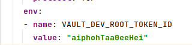
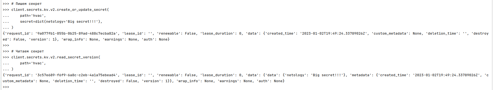

# Домашнее задание к занятию "14.2 Синхронизация секретов с внешними сервисами. Vault"

## Задача 1: Работа с модулем Vault

Запустить модуль Vault конфигураций через утилиту kubectl в установленном minikube

```
kubectl apply -f 14.2/vault-pod.yml
```

Получить значение внутреннего IP пода

```
kubectl get pod 14.2-netology-vault -o json | jq -c '.status.podIPs'
```

Примечание: jq - утилита для работы с JSON в командной строке

Запустить второй модуль для использования в качестве клиента

```
kubectl run -i --tty fedora --image=fedora --restart=Never -- sh
```

Установить дополнительные пакеты

```
dnf -y install pip
pip install hvac
```

Запустить интепретатор Python и выполнить следующий код, предварительно
поменяв IP и токен

```
import hvac
client = hvac.Client(
    url='http://10.10.133.71:8200',
    token='aiphohTaa0eeHei'
)
client.is_authenticated()

# Пишем секрет
client.secrets.kv.v2.create_or_update_secret(
    path='hvac',
    secret=dict(netology='Big secret!!!'),
)

# Читаем секрет
client.secrets.kv.v2.read_secret_version(
    path='hvac',
)
```

## Задача 2 (*): Работа с секретами внутри модуля

* На основе образа fedora создать модуль;
* Создать секрет, в котором будет указан токен;
* Подключить секрет к модулю;
* Запустить модуль и проверить доступность сервиса Vault.

# Ответ:
## Задание 1.
### Запустил vault и запомнил его ip:
```shell
dmitriy@dellix:~/netology/clokub-homeworks/14.2$ kubectl apply -f vault-pod.yml
pod/14.2-netology-vault created
dmitriy@dellix:~/netology/clokub-homeworks/14.2$ kubectl get pod 14.2-netology-vault -o json | jq -c '.status.podIPs'
[{"ip":"172.17.0.14"}]
```

### Подготовил клиента:
```shell
dmitriy@dellix:~/netology/clokub-homeworks/14.2$ kubectl run -i --tty fedora --image=fedora --restart=Never -- sh
If you don't see a command prompt, try pressing enter.
sh-5.2# dnf -y install pip
Fedora 37 openh264 (From Cisco) - x86_64                                                                                                                                                        1.6 kB/s | 2.5 kB     00:01    
Fedora Modular 37 - x86_64                                                                                                                                                                       96 kB/s | 3.0 MB     00:32    
Fedora 37 - x86_64 - Updates                                                                                                                                                                    4.5 MB/s |  19 MB     00:04    
Fedora Modular 37 - x86_64 - Updates                                                                                                                                                            1.3 MB/s | 1.1 MB     00:00    
Dependencies resolved.
================================================================================================================================================================================================================================
 Package                                                      Architecture                                     Version                                                  Repository                                         Size
================================================================================================================================================================================================================================
Installing:
 python3-pip                                                  noarch                                           22.2.2-3.fc37                                            updates                                           3.1 M
Installing weak dependencies:
 python3-setuptools                                           noarch                                           62.6.0-2.fc37                                            fedora                                            1.6 M

Transaction Summary
================================================================================================================================================================================================================================
Install  2 Packages

Total download size: 4.7 M
Installed size: 23 M
Downloading Packages:
(1/2): python3-setuptools-62.6.0-2.fc37.noarch.rpm                                                                                                                                              7.2 MB/s | 1.6 MB     00:00    
(2/2): python3-pip-22.2.2-3.fc37.noarch.rpm                                                                                                                                                     2.9 MB/s | 3.1 MB     00:01    
--------------------------------------------------------------------------------------------------------------------------------------------------------------------------------------------------------------------------------
Total                                                                                                                                                                                           1.9 MB/s | 4.7 MB     00:02     
Running transaction check
Transaction check succeeded.
Running transaction test
Transaction test succeeded.
Running transaction
  Preparing        :                                                                                                                                                                                                        1/1 
  Installing       : python3-setuptools-62.6.0-2.fc37.noarch                                                                                                                                                                1/2 
  Installing       : python3-pip-22.2.2-3.fc37.noarch                                                                                                                                                                       2/2 
  Running scriptlet: python3-pip-22.2.2-3.fc37.noarch                                                                                                                                                                       2/2 
  Verifying        : python3-setuptools-62.6.0-2.fc37.noarch                                                                                                                                                                1/2 
  Verifying        : python3-pip-22.2.2-3.fc37.noarch                                                                                                                                                                       2/2 

Installed:
  python3-pip-22.2.2-3.fc37.noarch                                                                            python3-setuptools-62.6.0-2.fc37.noarch                                                                           

Complete!
sh-5.2# pip install hvac
Collecting hvac
  Downloading hvac-1.0.2-py3-none-any.whl (143 kB)
     ━━━━━━━━━━━━━━━━━━━━━━━━━━━━━━━━━━━━━━━━ 143.5/143.5 kB 3.1 MB/s eta 0:00:00
Collecting pyhcl<0.5.0,>=0.4.4
  Downloading pyhcl-0.4.4.tar.gz (61 kB)
     ━━━━━━━━━━━━━━━━━━━━━━━━━━━━━━━━━━━━━━━━ 61.1/61.1 kB 11.7 MB/s eta 0:00:00
  Installing build dependencies ... done
  Getting requirements to build wheel ... done
  Preparing metadata (pyproject.toml) ... done
Collecting requests<3.0.0,>=2.27.1
  Downloading requests-2.28.1-py3-none-any.whl (62 kB)
     ━━━━━━━━━━━━━━━━━━━━━━━━━━━━━━━━━━━━━━━━ 62.8/62.8 kB 11.4 MB/s eta 0:00:00
Collecting charset-normalizer<3,>=2
  Downloading charset_normalizer-2.1.1-py3-none-any.whl (39 kB)
Collecting idna<4,>=2.5
  Downloading idna-3.4-py3-none-any.whl (61 kB)
     ━━━━━━━━━━━━━━━━━━━━━━━━━━━━━━━━━━━━━━━━ 61.5/61.5 kB 11.5 MB/s eta 0:00:00
Collecting urllib3<1.27,>=1.21.1
  Downloading urllib3-1.26.13-py2.py3-none-any.whl (140 kB)
     ━━━━━━━━━━━━━━━━━━━━━━━━━━━━━━━━━━━━━━━━ 140.6/140.6 kB 17.3 MB/s eta 0:00:00
Collecting certifi>=2017.4.17
  Downloading certifi-2022.12.7-py3-none-any.whl (155 kB)
     ━━━━━━━━━━━━━━━━━━━━━━━━━━━━━━━━━━━━━━━━ 155.3/155.3 kB 12.1 MB/s eta 0:00:00
Building wheels for collected packages: pyhcl
  Building wheel for pyhcl (pyproject.toml) ... done
  Created wheel for pyhcl: filename=pyhcl-0.4.4-py3-none-any.whl size=50127 sha256=ebb2e1c5033b4dec62602563c726857c9ac1904eb5d73591c97e2c41adb346cf
  Stored in directory: /root/.cache/pip/wheels/e4/f4/3a/691e55b36281820a2e2676ffd693a7f7a068fab60d89353d74
Successfully built pyhcl
Installing collected packages: pyhcl, urllib3, idna, charset-normalizer, certifi, requests, hvac
Successfully installed certifi-2022.12.7 charset-normalizer-2.1.1 hvac-1.0.2 idna-3.4 pyhcl-0.4.4 requests-2.28.1 urllib3-1.26.13
WARNING: Running pip as the 'root' user can result in broken permissions and conflicting behaviour with the system package manager. It is recommended to use a virtual environment instead: https://pip.pypa.io/warnings/venv
sh-5.2# 
```

### Запустил python поменял только ip, т.к. токен в env vault-pod.yml не менял:

```shell
sh-5.2# python3
Python 3.11.0 (main, Oct 24 2022, 00:00:00) [GCC 12.2.1 20220819 (Red Hat 12.2.1-2)] on linux
Type "help", "copyright", "credits" or "license" for more information.
>>> import hvac
>>> client = hvac.Client(
...     url='http://172.17.0.14:8200',
...     token='aiphohTaa0eeHei'
... )
>>> client.is_authenticated()
True
>>> # Пишем секрет
>>> client.secrets.kv.v2.create_or_update_secret(
...     path='hvac',
...     secret=dict(netology='Big secret!!!'),
... )
{'request_id': '9a077fb1-055b-0b25-89ad-488c7ecba82a', 'lease_id': '', 'renewable': False, 'lease_duration': 0, 'data': {'created_time': '2023-01-02T19:49:24.33789026Z', 'custom_metadata': None, 'deletion_time': '', 'destroyed': False, 'version': 1}, 'wrap_info': None, 'warnings': None, 'auth': None}
>>> 
>>> # Читаем секрет
>>> client.secrets.kv.v2.read_secret_version(
...     path='hvac',
... )
{'request_id': '3c57e689-f6f9-6a8c-c2eb-4a1a75ebead4', 'lease_id': '', 'renewable': False, 'lease_duration': 0, 'data': {'data': {'netology': 'Big secret!!!'}, 'metadata': {'created_time': '2023-01-02T19:49:24.33789026Z', 'custom_metadata': None, 'deletion_time': '', 'destroyed': False, 'version': 1}}, 'wrap_info': None, 'warnings': None, 'auth': None}
>>> 
```
Секрет получен.



---

### Как оформить ДЗ?

Выполненное домашнее задание пришлите ссылкой на .md-файл в вашем репозитории.

В качестве решения прикрепите к ДЗ конфиг файлы для деплоя. Прикрепите скриншоты вывода команды kubectl со списком запущенных объектов каждого типа (pods, deployments, statefulset, service) или скриншот из самого Kubernetes, что сервисы подняты и работают, а также вывод из CLI.

---
