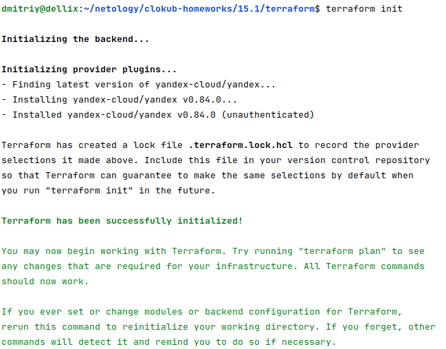
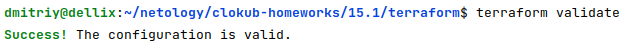
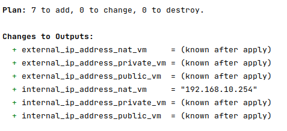
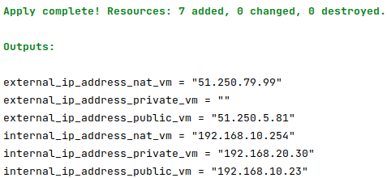
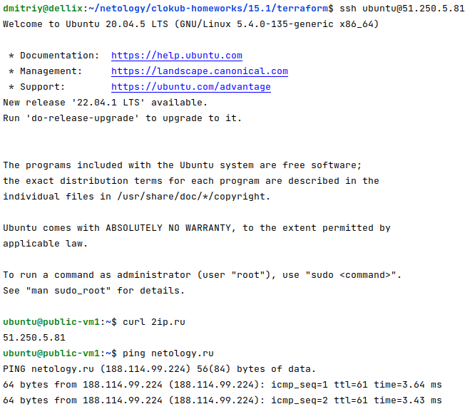
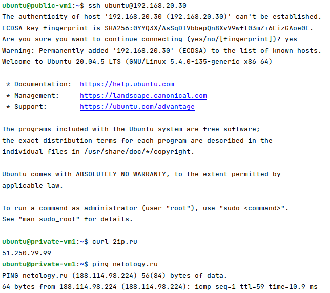
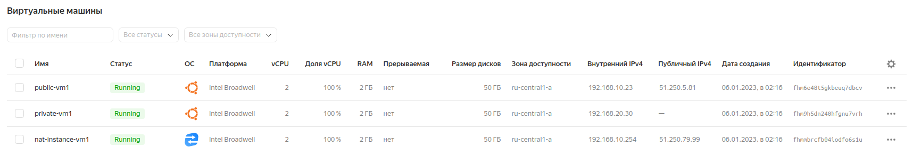
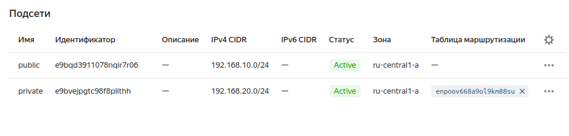
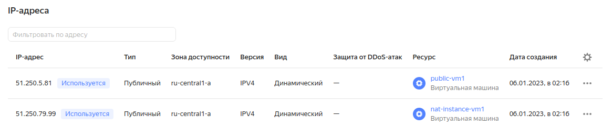
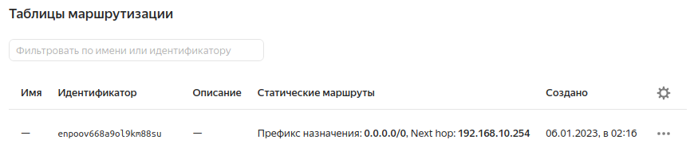

# Домашнее задание к занятию "15.1. Организация сети"

Домашнее задание будет состоять из обязательной части, которую необходимо выполнить на провайдере Яндекс.Облако и дополнительной части в AWS по желанию. Все домашние задания в 15 блоке связаны друг с другом и в конце представляют пример законченной инфраструктуры.  
Все задания требуется выполнить с помощью Terraform, результатом выполненного домашнего задания будет код в репозитории. 

Перед началом работ следует настроить доступ до облачных ресурсов из Terraform используя материалы прошлых лекций и [ДЗ](https://github.com/netology-code/virt-homeworks/tree/master/07-terraform-02-syntax ). А также заранее выбрать регион (в случае AWS) и зону.

---
## Задание 1. Яндекс.Облако (обязательное к выполнению)

1. Создать VPC.
- Создать пустую VPC. Выбрать зону.
2. Публичная подсеть.
- Создать в vpc subnet с названием public, сетью 192.168.10.0/24.
- Создать в этой подсети NAT-инстанс, присвоив ему адрес 192.168.10.254. В качестве image_id использовать fd80mrhj8fl2oe87o4e1
- Создать в этой публичной подсети виртуалку с публичным IP и подключиться к ней, убедиться что есть доступ к интернету.
3. Приватная подсеть.
- Создать в vpc subnet с названием private, сетью 192.168.20.0/24.
- Создать route table. Добавить статический маршрут, направляющий весь исходящий трафик private сети в NAT-инстанс
- Создать в этой приватной подсети виртуалку с внутренним IP, подключиться к ней через виртуалку, созданную ранее и убедиться что есть доступ к интернету

Resource terraform для ЯО
- [VPC subnet](https://registry.terraform.io/providers/yandex-cloud/yandex/latest/docs/resources/vpc_subnet)
- [Route table](https://registry.terraform.io/providers/yandex-cloud/yandex/latest/docs/resources/vpc_route_table)
- [Compute Instance](https://registry.terraform.io/providers/yandex-cloud/yandex/latest/docs/resources/compute_instance)
---
## Задание 2*. AWS (необязательное к выполнению)

1. Создать VPC.
- Cоздать пустую VPC с подсетью 10.10.0.0/16.
2. Публичная подсеть.
- Создать в vpc subnet с названием public, сетью 10.10.1.0/24
- Разрешить в данной subnet присвоение public IP по-умолчанию. 
- Создать Internet gateway 
- Добавить в таблицу маршрутизации маршрут, направляющий весь исходящий трафик в Internet gateway.
- Создать security group с разрешающими правилами на SSH и ICMP. Привязать данную security-group на все создаваемые в данном ДЗ виртуалки
- Создать в этой подсети виртуалку и убедиться, что инстанс имеет публичный IP. Подключиться к ней, убедиться что есть доступ к интернету.
- Добавить NAT gateway в public subnet.
3. Приватная подсеть.
- Создать в vpc subnet с названием private, сетью 10.10.2.0/24
- Создать отдельную таблицу маршрутизации и привязать ее к private-подсети
- Добавить Route, направляющий весь исходящий трафик private сети в NAT.
- Создать виртуалку в приватной сети.
- Подключиться к ней по SSH по приватному IP через виртуалку, созданную ранее в публичной подсети и убедиться, что с виртуалки есть выход в интернет.

Resource terraform
- [VPC](https://registry.terraform.io/providers/hashicorp/aws/latest/docs/resources/vpc)
- [Subnet](https://registry.terraform.io/providers/hashicorp/aws/latest/docs/resources/subnet)
- [Internet Gateway](https://registry.terraform.io/providers/hashicorp/aws/latest/docs/resources/internet_gateway)


# Ответ:

## Задание 1.

### Получил значения переменных yandex_cloud_id и yandex_folder_id из YC:

```shell
yc resource-manager cloud list
yc resource-manager folder list
```

### Написал конфигурационные файлы для тестовой инфраструктуры:

[terraform](15.1/terraform)

### Запустил инициализацию терраформа:

<details>
<summary>terraform init</summary>

```shell
dmitriy@dellix:~/netology/clokub-homeworks/15.1/terraform$ terraform init

Initializing the backend...

Initializing provider plugins...
- Finding latest version of yandex-cloud/yandex...
- Installing yandex-cloud/yandex v0.84.0...
- Installed yandex-cloud/yandex v0.84.0 (unauthenticated)

Terraform has created a lock file .terraform.lock.hcl to record the provider
selections it made above. Include this file in your version control repository
so that Terraform can guarantee to make the same selections by default when
you run "terraform init" in the future.

Terraform has been successfully initialized!

You may now begin working with Terraform. Try running "terraform plan" to see
any changes that are required for your infrastructure. All Terraform commands
should now work.

If you ever set or change modules or backend configuration for Terraform,
rerun this command to reinitialize your working directory. If you forget, other
commands will detect it and remind you to do so if necessary.
```
</details>



### Выполнил валидацию конфигурации:

```shell
dmitriy@dellix:~/netology/clokub-homeworks/15.1/terraform$ terraform validate 
Success! The configuration is valid.
```



### Выполнил планирование терраформ:

<details>
<summary>terraform plan</summary>

```shell
Plan: 7 to add, 0 to change, 0 to destroy.

Changes to Outputs:
  + external_ip_address_nat_vm     = (known after apply)
  + external_ip_address_private_vm = (known after apply)
  + external_ip_address_public_vm  = (known after apply)
  + internal_ip_address_nat_vm     = "192.168.10.254"
  + internal_ip_address_private_vm = (known after apply)
  + internal_ip_address_public_vm  = (known after apply)

```
</details>



### Применил конфигурацию:

<details>
<summary>terraform apply -auto-approve</summary>

```shell
Apply complete! Resources: 7 added, 0 changed, 0 destroyed.

Outputs:

external_ip_address_nat_vm = "51.250.79.99"
external_ip_address_private_vm = ""
external_ip_address_public_vm = "51.250.5.81"
internal_ip_address_nat_vm = "192.168.10.254"
internal_ip_address_private_vm = "192.168.20.30"
internal_ip_address_public_vm = "192.168.10.23"
```
</details>



Через публичный IP, подключился к виртуалке в публичной сети. Убедился, что есть доступ в интернет:

<details>
<summary>ssh ubuntu@51.250.5.81</summary>

```shell
dmitriy@dellix:~/netology/clokub-homeworks/15.1/terraform$ ssh ubuntu@51.250.5.81
Welcome to Ubuntu 20.04.5 LTS (GNU/Linux 5.4.0-135-generic x86_64)

 * Documentation:  https://help.ubuntu.com
 * Management:     https://landscape.canonical.com
 * Support:        https://ubuntu.com/advantage
New release '22.04.1 LTS' available.
Run 'do-release-upgrade' to upgrade to it.


The programs included with the Ubuntu system are free software;
the exact distribution terms for each program are described in the
individual files in /usr/share/doc/*/copyright.

Ubuntu comes with ABSOLUTELY NO WARRANTY, to the extent permitted by
applicable law.

To run a command as administrator (user "root"), use "sudo <command>".
See "man sudo_root" for details.

ubuntu@public-vm1:~$ curl 2ip.ru
51.250.5.81
ubuntu@public-vm1:~$ ping netology.ru
PING netology.ru (188.114.99.224) 56(84) bytes of data.
64 bytes from 188.114.99.224 (188.114.99.224): icmp_seq=1 ttl=61 time=3.64 ms
64 bytes from 188.114.99.224 (188.114.99.224): icmp_seq=2 ttl=61 time=3.43 ms
64 bytes from 188.114.99.224 (188.114.99.224): icmp_seq=3 ttl=61 time=3.44 ms
^C
--- netology.ru ping statistics ---
3 packets transmitted, 3 received, 0% packet loss, time 2003ms
rtt min/avg/max/mdev = 3.425/3.503/3.644/0.099 ms
```
</details>



### Через виртуалку в публичной сети, подключился к виртуалке во внутренней сети. Убедился, что есть доступ в интернет:

<details>
<summary>ssh -A ubuntu@51.250.5.81</summary>

```shell
dmitriy@dellix:~/netology/clokub-homeworks/15.1/terraform$ ssh -A ubuntu@51.250.5.81
Welcome to Ubuntu 20.04.5 LTS (GNU/Linux 5.4.0-135-generic x86_64)

 * Documentation:  https://help.ubuntu.com
 * Management:     https://landscape.canonical.com
 * Support:        https://ubuntu.com/advantage
New release '22.04.1 LTS' available.
Run 'do-release-upgrade' to upgrade to it.

Last login: Thu Jan  5 23:21:03 2023 from 46.22.56.16
To run a command as administrator (user "root"), use "sudo <command>".
See "man sudo_root" for details.

ubuntu@public-vm1:~$ ssh ubuntu@192.168.20.30
The authenticity of host '192.168.20.30 (192.168.20.30)' can't be established.
ECDSA key fingerprint is SHA256:0YYQ3X/AsSqDIVbbepQn8XvV9wfl03mZ+6EizGAoe0E.
Are you sure you want to continue connecting (yes/no/[fingerprint])? yes
Warning: Permanently added '192.168.20.30' (ECDSA) to the list of known hosts.
Welcome to Ubuntu 20.04.5 LTS (GNU/Linux 5.4.0-135-generic x86_64)

 * Documentation:  https://help.ubuntu.com
 * Management:     https://landscape.canonical.com
 * Support:        https://ubuntu.com/advantage

The programs included with the Ubuntu system are free software;
the exact distribution terms for each program are described in the
individual files in /usr/share/doc/*/copyright.

Ubuntu comes with ABSOLUTELY NO WARRANTY, to the extent permitted by
applicable law.

To run a command as administrator (user "root"), use "sudo <command>".
See "man sudo_root" for details.

ubuntu@private-vm1:~$ curl 2ip.ru
51.250.79.99
ubuntu@private-vm1:~$ ping netology.ru
PING netology.ru (188.114.98.224) 56(84) bytes of data.
64 bytes from 188.114.98.224 (188.114.98.224): icmp_seq=1 ttl=59 time=10.9 ms
64 bytes from 188.114.98.224 (188.114.98.224): icmp_seq=2 ttl=59 time=4.41 ms
^C
--- netology.ru ping statistics ---
2 packets transmitted, 2 received, 0% packet loss, time 1001ms
rtt min/avg/max/mdev = 4.408/7.648/10.888/3.240 ms
```
</details>



#### В данном случае, чтобы не копировать ssh ключи на виртуальную машину с внешним IP, как вариант, применл ключ -A для проброса ключей с локальной машины. 

#### Ключ -A мне требовалось применять только при запуске rsync с одного удаленного сервера на другой. Для более безопасного и удобного подключения, без проброса всех своих ключей, есть ключ -J, после которого указывается jump-server (сервер с внешним ip, находящийся в одной сети с целевой машиной):

#### Для удобства и работы scp надо добавить в описание подключения, в .ssh/config, параметр -  "ProxyJump ubuntu@51.250.5.81"

<details>
<summary>ssh -J ubuntu@51.250.5.81 ubuntu@192.168.20.30</summary>

```shell
dmitriy@dellix:~/netology/clokub-homeworks/15.1/terraform$ ssh -J ubuntu@51.250.5.81 ubuntu@192.168.20.30
The authenticity of host '192.168.20.30 (<no hostip for proxy command>)' can't be established.
ED25519 key fingerprint is SHA256:cORw6gbEfA4+12S+ZhLzypz1SK1f7qDPoX5PVjRxNqQ.
This key is not known by any other names
Are you sure you want to continue connecting (yes/no/[fingerprint])? yes
Warning: Permanently added '192.168.20.30' (ED25519) to the list of known hosts.
Welcome to Ubuntu 20.04.5 LTS (GNU/Linux 5.4.0-135-generic x86_64)

 * Documentation:  https://help.ubuntu.com
 * Management:     https://landscape.canonical.com
 * Support:        https://ubuntu.com/advantage
New release '22.04.1 LTS' available.
Run 'do-release-upgrade' to upgrade to it.

Last login: Thu Jan  5 23:24:58 2023 from 192.168.10.23
To run a command as administrator (user "root"), use "sudo <command>".
See "man sudo_root" for details.

ubuntu@private-vm1:~$ curl 2ip.ru
51.250.79.99
```
</details>

### Развёрнутые ресурсы в веб-интерфейсе Yandex.Cloud

#### Виртуальные машины:



#### Подсети:



#### Внешние IP-адреса:



#### Таблицы маршрутизации:



### В конце работы выполнил дестрой:

```shell
dmitriy@dellix:~/netology/clokub-homeworks/15.1/terraform$ terraform destroy
...........
Destroy complete! Resources: 7 destroyed.
```